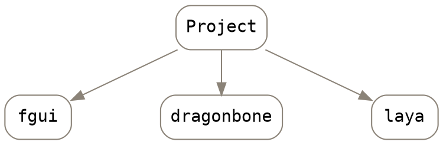

# FairyGUI helpbook
#### 相關教程
  金波資料交換暫存區 - FairyGUI-Tutorial

#### 環境設置
::: info 
注意:若在fairyGUI官網下載SDK(laya版)，請確認Branch版本(選layaair2.0-2.1)
:::


----
#### 3.10版以上
安裝後，第一次設置project時，可刪除多餘檔案，將assets, settings, fairy, FGUIDemo等資料夾。

#### git 上架結構
專案下設置3個目錄, 分別為:



 DragonBone
:::info
(設計完成的龍骨)置於NAS，修改以資料夾命名日期，並通知專案TA，一律由TA 做版控上傳Git
:::
 fgui
 :::info
工作檔上傳至dev branch(fgui目錄下)
:::
 laya
:::info
 管理 ． laya (TA若有需求, 可與前端溝通新增branch)
:::

----

# 關聯設置方式
:::info 
#### 父子層級概念:
先選子物件，指定關聯父物件，便可定義其關係; 父層級移動，子層級按定義關係相對移動
:::
#### TA應用
|選廳頁|規格|
|:---|---|
|荷官(龍骨動畫)|容器組件, 左右居中, 底底(9/24修訂)|

|主遊戲場景|規格|
|:---|---|
|牌局編號及底分 |對齊左上角功能鍵  |

----
# 圖片
#### 1. Mask
>ex:如欲達到光暈遮罩
>
>
>點選空白處，於「基本設置」內設定「自定義遮罩」(選遮罩物件)


#### 2. 透明度
>可於「基本」設置透明度

#### 3. Anchor
>人像圖片設中心「錨點」:
由於前端可能需要派獎(動畫)跑向人像中心，故採此做法

       {anchor="true" }
---
#### 控制器
將控制器導出至其他場景:


**~~控制彈窗~~**
~~將動作>改變其他控制器頁面，可用Button控制彈窗:~~


#### 命名原則
控制器命名時，請避開重覆名稱; 在發佈ts後，相同name會自動命名而無法從xml查到:


#### TA應用

<table>
  <thead>
    <tr>
      <th style="text-align:left">控制器</th>
      <th style="text-align:left">規格</th>
    </tr>
  </thead>
  <tbody>
    <tr>
      <td style="text-align:left">語系控制器</td>
      <td style="text-align:left">
        <p>簡中: 「zh-CN」</p>
        <p>英文:「en-US」(注意大小寫)</p>
      </td>
    </tr>
  </tbody>
</table>

---
# 按鈕 btn

創建方式:
除了工具列上新增方式，亦可按快捷方式創建


從組件轉換成btn:


#### TA應用

<table>
  <thead>
    <tr>
      <th style="text-align:left">按鈕</th>
      <th style="text-align:left">規格</th>
    </tr>
  </thead>
  <tbody>
    <tr>
      <td style="text-align:left">系統按鈕(選廳頁)</td>
      <td style="text-align:left">
        <p>不勾「選中</p>
        <p>不連接場景</p>
        <p>設為普通按鈕 (由前端設定動作)</p>
      </td>
    </tr>
    <tr>
      <td style="text-align:left">系統按鈕_左上(主遊戲)</td>
      <td
      style="text-align:left">
        <p>90X90</p>
        <p>距離邊界20</p>
        </td>
    </tr>
    <tr>
      <td style="text-align:left">操作按鈕(主遊戲)</td>
      <td style="text-align:left">180X90</td>
    </tr>
    <tr>
      <td style="text-align:left">結算畫面</td>
      <td style="text-align:left">僅「繼續遊戲/Continue」</td>
    </tr>
    <tr>
      <td style="text-align:left">金額刷新按鈕(全遊戲)</td>
      <td
      style="text-align:left">皆無需重新整理按鈕，可製作並隱藏</td>
    </tr>
  </tbody>
</table>

---

# progress bar


---

# Transition
:::info
請關掉自動播放，由前端控制。
:::

#### 首幀設Key

由於動效在repeat時，會跳回第一個key幀，故在此建議第一幀無論有否動態，都Key下第一幀


#### 鎖定


#### 緩動函數

詳見[參考](https://greensock.com/ease-visualizer)

#### 動效因果關係


#### TA應用

| 動效 | 規格 |
| :---: | :--- |
| 房間按鈕 | 元件表演即可 |

---
# DragonBone

#### 說明

由於fairy無法直接載入DragonBone\(DB\), 故採laya寫loader 指定該DB。

#### 步驟

1. 新增空物件
2. 自定義數據 
3. 調整大小\(勿用縮放Scale\), 縮放值由前端調整
4. 位置在輸出後會不一致，需要來回確認修正

```
Dragonbone=dragonbone/three_cards_girl.sk,L,B
```


---
# errors

:::warning
※切記在GUI排版必須確認場景的控制狀態都回到「初始值」再存檔，避免發生流程或控制上的錯誤※
:::

#### 無預警變動XML


#### 解決方式

由於fairy會預設將控制器裝載到此場景，每次更動一律需要手動選定某一項目，否則預設會以目前狀態裝載，最終導致悄悄存檔而無所知。

#### 待解

閃爍問題: \(未解決\) 可能由laya 或 fairy造成

文字輸出至平台漏字問題\(未解決\): ios 變新明體等

---
# text

#### 預設字體

雖有預設字體，為確保xml會有字體註解，請逐一個別選定字體; _"這樣xml 才有註解字體"_。

#### 靜態文字

先在none狀態下調整字體大小，最後再以「自動收縮」處理;_只有在"無"與"自動收縮"情況下，才不會變更到文字物件寬度_。

#### 動態文字

方式同上


:::info 
請特別註記以下情況: 需要單行/清空
:::


#### TA應用

>文本行距 一律改為0 \(預設為3\)

<table>
  <thead>
    <tr>
      <th style="text-align:center">選廳頁</th>
      <th style="text-align:left">規格</th>
    </tr>
  </thead>
  <tbody>
    <tr>
      <td style="text-align:center">玩家ID</td>
      <td style="text-align:left">不論中英文，最多為13個字元
        <br
        />指定寬高後「自動縮放」
        <br
        />最小20pt</td>
    </tr>
    <tr>
      <td style="text-align:center"> 選房金額</td>
      <td style="text-align:left">
        <p>最多5位數(含小數點)</p>
        <p>小數位: 最多至小數第2位</p>
        <p>ex: 99.99, 999.99</p>
        <p>遇千則變K</p>
        <p>實際金額最多6位數(此情況由前端控制),
          999.99K</p>
      </td>
    </tr>
  </tbody>
</table><table>
  <thead>
    <tr>
      <th style="text-align:center">主遊戲</th>
      <th style="text-align:left">規格</th>
    </tr>
  </thead>
  <tbody>
    <tr>
      <td style="text-align:center">牌局</td>
      <td style="text-align:left">一律用「GAME」</td>
    </tr>
    <tr>
      <td style="text-align:center">玩家ID、金額數字</td>
      <td style="text-align:left">
        <p>最小20pt</p>
        <p>ID不論長度，一律顯示「前6位中/英文+...」(3個點)</p>
      </td>
    </tr>
    <tr>
      <td style="text-align:center">玩家金額</td>
      <td style="text-align:left">
        <p>9位+2位小數點</p>
        <p>ex: 123,456,789.12</p>
      </td>
    </tr>
    <tr>
      <td style="text-align:center">籌碼金額</td>
      <td style="text-align:left">
        <p>最多5位數(含小數點)</p>
        <p>小數位: 最多至小數第2位</p>
        <p>ex: 99.99, 999.99</p>
        <p>遇千則變K</p>
        <p>實際金額最多6位數(此情況由前端控制),
          999.99K</p>
      </td>
    </tr>
    <tr>
      <td style="text-align:center">搶莊倍數</td>
      <td style="text-align:left">
        <p>一律用「X」代表倍率</p>
        <p>ex: X10, X20</p>
      </td>
    </tr>
  </tbody>
</table><table>
  <thead>
    <tr>
      <th style="text-align:center">全遊戲</th>
      <th style="text-align:left">規格</th>
    </tr>
  </thead>
  <tbody>
    <tr>
      <td style="text-align:center">跑馬燈</td>
      <td style="text-align:left">
        <p>&#x6700;&#x5C0F;20pt</p>
        <p></p>
      </td>
    </tr>
    <tr>
      <td style="text-align:center">按鈕、彈窗標題</td>
      <td style="text-align:left">英文一律大寫</td>
    </tr>
    <tr>
      <td style="text-align:center">版本號</td>
      <td style="text-align:left">
        <p>ex: v0.0.0_1234567890</p>
        <p>TA排版，由前端控制</p>
      </td>
    </tr>
  </tbody>
</table><table>
  <thead>
    <tr>
      <th style="text-align:center">百人系列</th>
      <th style="text-align:left">規格</th>
    </tr>
  </thead>
  <tbody>
    <tr>
      <td style="text-align:center">側表玩家ID</td>
      <td style="text-align:left">
        <p>不論長度，一律顯示三個*+ 最多三個英文字</p>
        <p>ex:***abc</p>
        <p>***ab</p>
        <p>***a (前面的*是保密作用)</p>
      </td>
    </tr>
    <tr>
      <td style="text-align:center">側表玩家金額</td>
      <td style="text-align:left">不放金額</td>
    </tr>
  </tbody>
</table>

---
# xml

#### 註解方式

```xml=
<!--我是註解-->
```

#### 關聯設置

例:以target 為父級，並以頂-頂，中心-中心\(百分比\)

```xml=
<relation target="XXX" sidePair="top-top,center-center%"/>
```
:::info
需設置於該物件內
:::
```xml=
<component id="n63_finl" name="p2" src="finlrkhfg" fileName="views/card/card_point2.xml" xy="10,15" pivot="0.5,0.5" size="145,39" aspect="true" controller="language,0">
      <gearDisplay controller="msg" pages="2"/>
      <relation target="n62_hw63" sidePair="left-left%"/>
      <relation target="" sidePair="width-width,height-height"/>
</component>
```

#### 動效呈現
 
以組件ID\(ex:n55\_hw63\)排序，並按關鍵幀依次設置，參考下例

```xml=
<transition name="point1">
    <item time="0" type="Alpha" target="n55_hw63" value="0"/>
    <item time="0" type="Alpha" target="n92_u298" tween="true" startValue="0" endValue="1" duration="5"/>
    <item time="0" type="Scale" target="n55_hw63" value="1,1"/>
    <item time="0" type="XY" target="n92_u298" tween="true" startValue="-340,-" endValue="0,-" duration="5"/>
    <item time="4" type="Alpha" target="n55_hw63" tween="true" startValue="0" endValue="1" duration="4"/>
    <item time="4" type="Scale" target="n55_hw63" tween="true" startValue="0,0" endValue="1.25,1.25" duration="3"/>
    <item time="4" type="Sound" value="ui://94hasbw3u298rkhgr,100"/>
    <item time="7" type="Scale" target="n55_hw63" tween="true" startValue="1.25,1.25" endValue="1,1" duration="2"/>
</transition>
```

#### 文字呈現(需注意順序)

* font 指定字體
* align 對齊方式
* leading 行距
* autoSize 自動縮放
* singleLine 單行
* autoClearText 清除文本

```xml=
<text id="n66_uf0j" name="TF_money_num" xy="223,51" pivot="0,0.5" size="155,30" font="Microsoft YaHei" fontSize="20" color="#cccccc" align="center" vAlign="middle" leading="0" autoSize="shrink" singleLine="true" autoClearText="true" text="999,999,999.99">
      <relation target="n89_nl4m" sidePair="middle-middle"/>
      <relation target="n60_6ylk" sidePair="left-right"/>
</text>
```
---
# popup

* 請儘將元件按原比例輸出\(不需要逐一1280\*720\)
* 無需放置場景內, 前端會自行調用, 只需設該component " set exported"
* 並物件內元素請中心置中

#### TA應用

<table>
  <thead>
    <tr>
      <th style="text-align:left">彈窗</th>
      <th style="text-align:left">規格</th>
    </tr>
  </thead>
  <tbody>
    <tr>
      <td style="text-align:left">動效樣式(彈窗)</td>
      <td style="text-align:left">全遊戲統一</td>
    </tr>
    <tr>
      <td style="text-align:left">語系(彈窗)</td>
      <td style="text-align:left">沒有X按鈕</td>
    </tr>
    <tr>
      <td style="text-align:left">error code(彈窗)</td>
      <td style="text-align:left">
        <p>遊戲進行前、後，僅用「確認」按鈕</p>
        <p>軸心:中心(0.5)</p>
        <p>勿設「自動播放」</p>
        <p>進出場動效命名: zoomin / zoomout</p>
        <p>無需置於場景，個別設置為導出</p>
      </td>
    </tr>
  </tbody>
</table>

---
# export

> _資料夾創建方式依情況與前端溝通_

輸出分為兩種資料夾

* 圖、fgui\(..\專案\_laya\bin\package\fgui\)
* code\(應設置為..\專案\_laya\src\ui\)

\(先行預覽\)分別置於

* 圖、fgui置於..\專案\_laya\bin\OGTFC\fgui\package
* code置於..\專案\_laya\src\ui
* SKLoader等
  * 將SKLoader置於ui 資料夾內
  * 將main, binder等ts 置於src即可

_前端相關設定，亦可參考[Layabook]_(https://goldbook.gitbook.io/layabook/)

:::danger
若遇laya debug時，chrome 空白頁情況請應terminal用以下方式開啟chrome\(osx\)
:::

```
open -n -a /Applications/Google\ Chrome.app/Contents/MacOS/Google\ Chrome --args --user-data-dir="/tmp/chrome_dev_test" --disable-web-security
```

#### 設置發佈方式

於資源庫，選定組件並按右鍵指定輸出，亦可自訂Hotkey快速鍵使用

#### 注意
:::info
確保該輸出的圖片/字體設定「輸出」
:::
請將所有前端所需調用的圖片、字體，記得都設為set exported，才不會只導出該\(輸出\)場景有用到的組件而已，前端將調用不到需變更的圖、字體。


> ex:前端需調用之卡/牌型/圖文字體等
>上傳至git之前，請確認資料夾內有無錯誤檔案


ex: osx 在publish後，會將發佈檔案夾隱藏在專案根目錄之下 ，請將該隱藏檔案刪除乾淨再上傳。

terminal
```
defaults write com.apple.finder AppleShowAllFiles TRUE;\killall Finder
```

_Read [_more_](https://0800happy.com/8284/)_

#### TA應用

| 頁面 |  |
| :---: | :--- |
| Loading | 全系列遊戲共用，由前端操作，TA無需製作 |

---
# files

#### 替換場景內元件

顯示列表，右鍵選「替換元件」

#### 找尋元件所在資源位址

顯示列表，右鍵選「在庫中顯示」

#### 找尋元件依賴場景

資源庫，右鍵選「依賴關係查詢」；或，上排工具列的「工具」選項亦有相同功能

#### 偏好設置

建議練熟「熱鍵」並自定義尚未定義的設定

#### 複製、貼上

ctrl shift V 原地貼上